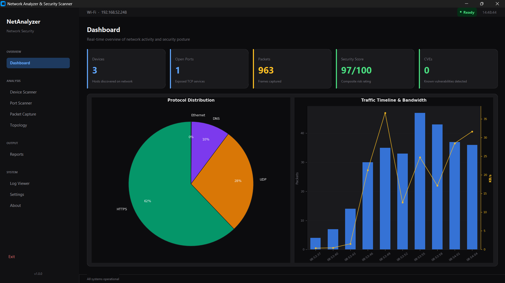

# Network Analyzer & Security Scanner

A defensive network security toolkit for mapping local networks, auditing open ports, capturing live traffic, performing OS fingerprinting, and generating security reports — all from a clean desktop interface.

Built with Python and CustomTkinter. No Administrator privileges required for subnet scanning and port auditing; packet capture requires Admin rights.



---

## Features

- **Device Discovery** — ARP-based subnet scanning with OS fingerprinting (TTL analysis), vendor lookup (OUI resolution), and banner grabbing.
- **Port Scanner** — TCP and UDP scanning in Quick (common ports), Full (1–1024), Extreme (1–65535), and Custom modes. Up to 2000 concurrent workers.
- **Packet Sniffer** — Live packet capture with protocol classification (TCP, UDP, ICMP, DNS, ARP, HTTP, HTTPS) and traffic statistics.
- **Dashboard** — Real-time visualizations: device status pie chart, protocol distribution bar chart, risk overview, and timeline.
- **Reports** — Generate PDF, CSV, and JSON security reports with risk scoring and remediation recommendations.
- **Log Viewer** — Live application log monitoring with level filtering and search.
- **Cross-platform** — Windows, Linux, macOS (packet capture requires Npcap/libpcap).

---

## Requirements

- Python 3.10+
- Npcap (Windows) or libpcap (Linux/macOS) — required only for live packet capture
- Administrator/root privileges — required only for live packet capture

### Dependencies

| Package | Purpose |
|---|---|
| CustomTkinter | Desktop UI framework |
| Scapy | Packet capture and network discovery |
| Matplotlib | Dashboard charts |
| ReportLab | PDF report generation |
| psutil | Network interface detection |

---

## Installation

1. **Clone the repository:**
   ```bash
   git clone <your-repo-url>
   cd Zeetron_project
   ```

2. **Install Python dependencies:**
   ```bash
   pip install -r requirements.txt
   ```

3. **Install Npcap (Windows only — for packet capture):**
   Download from [npcap.com](https://npcap.com/) and install with "WinPcap API‑compatible Mode" enabled.

4. **Run the application:**
   ```bash
   python app.py
   ```

---

## Usage

| Feature | How to use |
|---|---|
| **Network Scan** | Enter subnet (e.g. `10.0.0.0/24`) and click Scan |
| **Port Scan** | Select target device, choose mode (Quick/Full/Extreme/Custom), pick protocol (TCP/UDP/Both) |
| **Packet Capture** | Select interface, choose protocol filter, click Start |
| **Reports** | Go to Reports page, click PDF/CSV/JSON to generate |
| **Settings** | Configure theme, timeouts, packet limits, and report path |
| **Log Viewer** | View live application logs with level and text filtering |

---

## Building the Executable

To compile the application into a standalone executable directory:

1. **Install requirements:**
   ```bash
   pip install -r requirements.txt
   ```

2. **Run PyInstaller using the spec file:**
   ```bash
   pyinstaller --clean --noconfirm NetworkAnalyzer.spec
   ```

The compiled output will be generated inside the `dist/NetworkAnalyzer/` directory.

---

## Running & Sharing the Pre-built Executable

If you wish to share the compiled executable with others:

1. **Compress the Folder**: Since this is a directory-based build (which starts up much faster), you must share the entire `dist/NetworkAnalyzer/` folder. Right-click the folder and compress it into a **ZIP** file for distribution.
2. **Npcap Dependency**: The recipient's machine **must** have **Npcap** (or WinPcap) installed to use the Packet Capture and ARP-based network scanning features. They can download it from [npcap.com](https://npcap.com/).
3. **Run as Administrator**: Right-click `NetworkAnalyzer.exe` inside the extracted folder and select **"Run as Administrator"** to allow the application to bind to network interfaces and send raw packets.

---

## Project Structure

```
├── app.py                  # Application entry point
├── config/                 # Configuration manager and settings
│   ├── config.py
│   └── settings.json       # User preferences (gitignored)
├── core/                   # Backend engine modules
│   ├── network_scanner.py  # Device discovery and OS fingerprinting
│   ├── port_scanner.py     # TCP/UDP port scanning
│   ├── packet_sniffer.py   # Live packet capture
│   ├── protocol_analyzer.py# Protocol classification
│   ├── report_generator.py # PDF/CSV/JSON report generation
│   ├── risk_engine.py      # Vulnerability scoring
│   ├── statistics_engine.py# Traffic analytics
│   ├── database.py         # SQLite data layer
│   ├── event_bus.py        # Inter-component messaging
│   ├── thread_manager.py   # Background worker management
│   ├── helpers.py          # Utility functions
│   ├── vendor_lookup.py    # OUI → manufacturer resolution
│   └── constants.py        # Application constants
├── ui/                     # Frontend pages and widgets
│   ├── app_window.py       # Main window, sidebar, navigation
│   ├── dashboard.py        # Overview charts
│   ├── scanner_page.py     # Device scanner UI
│   ├── port_page.py        # Port scanner UI
│   ├── packet_page.py      # Packet sniffer UI
│   ├── reports_page.py     # Report generation UI
│   ├── settings_page.py    # Configuration UI
│   ├── log_viewer_page.py  # Log monitoring UI
│   ├── about_page.py       # About and credits
│   └── themes/             # Design tokens and colors
├── database/               # SQLite database files (gitignored)
├── logs/                   # Application logs (gitignored)
├── reports/                # Generated reports (gitignored)
├── tests/                  # Test suite
└── requirements.txt        # Python dependencies
```

---

## Security Notes

- No absolute path with usernames is stored in the database, logs, or config.
- Paths in reports and settings are project-relative.
- Sensitive files (`settings.json`, `*.db`, `logs/`) are gitignored.
- The tool is designed for **authorized networks only**.

---

## License

MIT License — see [LICENSE](LICENSE) file for details.

---

## Authors

- **Vikash Jakhar**
- **Anisha Verma**
