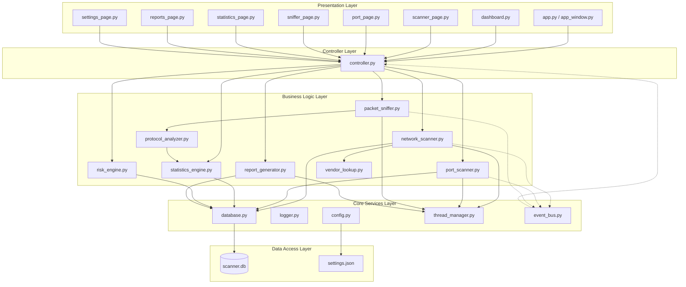

# Implementation Plan - Network Analyzer & Security Scanner

This document outlines the master analysis, architectural review, and implementation strategy for the **Network Analyzer & Security Scanner** Windows desktop application. It acts as the single source of truth for the project's development workflow.

---

## Executive Summary

The **Network Analyzer & Security Scanner** is a Windows desktop application (Windows 10/11) designed to provide local network discovery, TCP port scanning, packet capture, protocol analysis, security scoring, and report generation in an educational, defensive, and visually engaging format. 

Built using a layered modular Python stack, the application combines powerful system-level tools (Scapy, sockets) with a modern CustomTkinter graphical dashboard. Rather than replacing enterprise-grade toolkits like Nmap or Wireshark, it aims to visualize core networking and cybersecurity concepts for students, learners, and trainers.

---

## User Review Required

We have analyzed all 20 planning documents in the [plan](file:///c:/Users/vikas/Desktop/Zeetron_project/plan/) folder and identified several technical risks, ambiguities, and architectural gaps. Below are the key architectural improvements recommended before development starts:

> [!IMPORTANT]
> **1. Settings Single Source of Truth**
> The documentation suggests storing settings in both `settings.json` (architecture specs) and a SQLite database table. To avoid data synchronization errors, we recommend storing config parameters strictly in `config/settings.json` and removing the SQLite `settings` table. SQLite should only store transient scan logs, packet data, reports, and event logs.

> [!IMPORTANT]
> **2. SQLite Write-Ahead Logging (WAL) & Serialized Queue**
> With multiple background threads (Network Scanner, Port Scanner, Packet Sniffer) writing to the database concurrently, standard SQLite operations will face `database is locked` exceptions. We propose running SQLite in WAL mode and routing all write queries through a serialized thread-safe queue in `DatabaseManager` to prevent concurrency failures.

> [!IMPORTANT]
> **3. Packet Sniffer UI Rate Limiter**
> Capturing packets on an active network can generate hundreds of events per second. Directly updating CustomTkinter widgets for every captured packet will exhaust the main UI thread. We suggest queuing captured packets in a thread-safe memory queue and refreshing the UI tables at a maximum frequency of 5–10 Hz (batch inserts).

> [!IMPORTANT]
> **4. Admin Rights & Npcap Startup Checks**
> Scapy packet sniffing requires administrator privileges and the Npcap loopback/network driver on Windows. The application must perform startup bootstrap checks. If either is missing, it should display a clean, informative alert explaining how to install Npcap or restart the application as administrator, rather than crashing silently.

> [!TIP]
> **5. Offline Vendor OUI Database Lookup**
> Active network scanning should be fully functional offline. Instead of calling web-based MAC lookup APIs, we will embed a lightweight, compressed static mapping of common MAC prefixes (OUI) to vendors (e.g., Cisco, Intel, Dell) within `core/vendor_lookup.py`.

---

## Open Questions

Before proceeding, please review the following design decisions:

1. **Packet Capture Retention Policy**: High-volume sniffing can cause the SQLite file size to bloat rapidly. Do you agree to implement a default database limit of keeping only the last 5,000 captured packets per session, automatically purging older packets?
2. **Subnet Scope Restriction**: Should the application prevent users from entering external IP ranges (e.g., scanning public internet subnets) to strictly enforce the "defensive and local network only" scope? We recommend restricting scans to RFC 1918 private subnets (e.g., `10.0.0.0/8`, `172.16.0.0/12`, `192.168.0.0/16`).

---

## Proposed Changes

The following section outlines the structural breakdown, dependency model, and component layout for the application.

### Module Dependency Graph



---

### Component-wise File Layout

We will group our implementation into logical packages: Configuration & Core Services, Backend Scanner & Sniffers, Engine Analytics, and Presentation Widgets.

#### [NEW] [config.py](file:///c:/Users/vikas/Desktop/Zeetron_project/config/config.py)
Configuration Manager responsible for reading, saving, and validating settings from `config/settings.json`.

#### [NEW] [settings.json](file:///c:/Users/vikas/Desktop/Zeetron_project/config/settings.json)
Static JSON configuration repository storing application preferences (theme, timeouts, limits, paths).

#### [NEW] [database.py](file:///c:/Users/vikas/Desktop/Zeetron_project/core/database.py)
Database Manager utilizing SQLite. Contains table initializations (`devices`, `port_scans`, `packets`, `reports`, `logs`), WAL mode activation, index creation, parameterized queries, and serialized background write queue.

#### [NEW] [logger.py](file:///c:/Users/vikas/Desktop/Zeetron_project/core/logger.py)
Central logging subsystem storing rotating logs in `logs/scanner.log`.

#### [NEW] [thread_manager.py](file:///c:/Users/vikas/Desktop/Zeetron_project/core/thread_manager.py)
Custom thread manager to spin up, monitor, and safely terminate worker threads without blockading CustomTkinter.

#### [NEW] [event_bus.py](file:///c:/Users/vikas/Desktop/Zeetron_project/core/event_bus.py)
A lightweight event publish-subscribe system to dispatch backend state changes (e.g., `DEVICE_DISCOVERED`, `PACKET_RECEIVED`) to the UI controllers.

#### [NEW] [network_scanner.py](file:///c:/Users/vikas/Desktop/Zeetron_project/core/network_scanner.py)
ARP/ICMP subnet device discovery module. Contains hostname resolver, response-time checks, and MAC vendor resolution hooks.

#### [NEW] [vendor_lookup.py](file:///c:/Users/vikas/Desktop/Zeetron_project/core/vendor_lookup.py)
Offline MAC address prefix lookup utilizing an embedded list of core networking manufacturer OUIs.

#### [NEW] [port_scanner.py](file:///c:/Users/vikas/Desktop/Zeetron_project/core/port_scanner.py)
Multi-threaded TCP socket scanner. Supports Quick Scan (top 100 ports), Full Scan (1-65535), Custom Scan, and basic banner grab service identification.

#### [NEW] [packet_sniffer.py](file:///c:/Users/vikas/Desktop/Zeetron_project/core/packet_sniffer.py)
Scapy packet sniffing capture interface. Utilizes stop-filter flag checks to guarantee clean capture termination.

#### [NEW] [protocol_analyzer.py](file:///c:/Users/vikas/Desktop/Zeetron_project/core/protocol_analyzer.py)
Classifies packet payloads into ARP, ICMP, DNS, HTTP, HTTPS, TCP, and UDP protocols and compiles session statistics.

#### [NEW] [statistics_engine.py](file:///c:/Users/vikas/Desktop/Zeetron_project/core/statistics_engine.py)
Calculates traffic volume, timeline series, and top active hosts for the dashboard.

#### [NEW] [risk_engine.py](file:///c:/Users/vikas/Desktop/Zeetron_project/core/risk_engine.py)
Calculates overall network/device security score based on open vulnerable ports (e.g., Telnet, FTP, HTTP) and returns human-readable recommendations.

#### [NEW] [report_generator.py](file:///c:/Users/vikas/Desktop/Zeetron_project/core/report_generator.py)
Report compiler converting database records into PDF reports (using ReportLab with tables, text flow, and charts), CSV exports, and structured JSON files.

#### [NEW] [validators.py](file:///c:/Users/vikas/Desktop/Zeetron_project/core/validators.py)
Core utility validation suite verifying IPv4 addresses, MAC addresses, port boundaries, and network subnets.

#### [NEW] [app_window.py](file:///c:/Users/vikas/Desktop/Zeetron_project/ui/app_window.py)
The primary CustomTkinter viewport container housing the navigation sidebar, header, dynamic status indicators, and main page swap deck.

#### [NEW] [dashboard.py](file:///c:/Users/vikas/Desktop/Zeetron_project/ui/dashboard.py)
Main workspace screen containing security score cards, active devices counters, and basic Matplotlib preview summaries.

#### [NEW] [app.py](file:///c:/Users/vikas/Desktop/Zeetron_project/app.py)
The main application bootstrap file. Orchestrates admin privilege checks, Npcap availability checks, initializes database and config systems, and launches the UI loop.

---

## Development Timeline (10-Day Phase Roadmap)

Below is the Master Development timeline designed to ensure stable, incremental delivery of the application modules.

```
Day 1-2: Phase 1 (Setup, Logging, Config, Database initialization)
Day 3-4: Phase 2 (Network Discovery Scanner, Offline Vendor OUI lookup)
Day 5-6: Phase 3 (Multi-threaded Port Scanner, Scapy Sniffer & Protocol Analyzer)
Day 7-8: Phase 4 (Analytics engines, Report Generator, custom PDF/CSV output)
Day 9-10: Phase 5 (GUI Layout, Matplotlib, Event Integration, PyInstaller, QA)
```

### Phase 1: Foundation & Infrastructure (Days 1–2)
*   **Goal**: Establish a robust, error-tolerant base with persistent configurations, logging, and database layers.
*   **Modules Included**: [config.py](file:///c:/Users/vikas/Desktop/Zeetron_project/config/config.py), [database.py](file:///c:/Users/vikas/Desktop/Zeetron_project/core/database.py), [logger.py](file:///c:/Users/vikas/Desktop/Zeetron_project/core/logger.py), [thread_manager.py](file:///c:/Users/vikas/Desktop/Zeetron_project/core/thread_manager.py), [event_bus.py](file:///c:/Users/vikas/Desktop/Zeetron_project/core/event_bus.py), [validators.py](file:///c:/Users/vikas/Desktop/Zeetron_project/core/validators.py).
*   **Dependencies**: sqlite3, python-logging, json.
*   **Risks**: Database lock contention during high-speed parallel operations.
*   **Deliverables**: Working logging directory, sqlite file initialized, event bus passing message callbacks, unit tests for core services.
*   **Completion Criteria**: Database tables are generated correctly, configuration is read/written to file, logger rotates log messages, and no thread blockades occur during simulation.
*   **Git Commit Suggestion**: `feat: init foundation setup, configuration manager, logging and database schema initialization`

### Phase 2: Network Discovery Module (Days 3–4)
*   **Goal**: Enable secure local subnet discovery and MAC prefix hardware vendor resolution.
*   **Modules Included**: [network_scanner.py](file:///c:/Users/vikas/Desktop/Zeetron_project/core/network_scanner.py), [vendor_lookup.py](file:///c:/Users/vikas/Desktop/Zeetron_project/core/vendor_lookup.py).
*   **Dependencies**: Scapy (ARP), python-socket, ipaddress.
*   **Risks**: Subnet IP resolution timeouts and host blocking.
*   **Deliverables**: Multi-threaded discovery driver returning active subnet devices, matching manufacturer vendor strings offline.
*   **Completion Criteria**: Discovers local hosts, maps MAC addresses to vendors, writes results cleanly to the SQLite database without freezing thread contexts.
*   **Git Commit Suggestion**: `feat: network scanner module with hostname resolution and offline vendor OUI lookup`

### Phase 3: Port Scan & Live Sniffer Core (Days 5–6)
*   **Goal**: Build scanning engines for TCP port auditing and a packet capturer for raw packet streams.
*   **Modules Included**: [port_scanner.py](file:///c:/Users/vikas/Desktop/Zeetron_project/core/port_scanner.py), [packet_sniffer.py](file:///c:/Users/vikas/Desktop/Zeetron_project/core/packet_sniffer.py), [protocol_analyzer.py](file:///c:/Users/vikas/Desktop/Zeetron_project/core/protocol_analyzer.py).
*   **Dependencies**: socket, scapy.all.sniff.
*   **Risks**: Scapy socket permissions, network firewalls blocking port probes, and high-frequency packet processing overhead.
*   **Deliverables**: Port scanner with custom ranges, packet sniffer producing structured protocol packets, and analyzer mapping traffic counts.
*   **Completion Criteria**: Port scans identify open/closed sockets, sniffing can start/stop safely, and packets are classified by protocol (TCP/UDP/DNS/HTTP) into the database.
*   **Git Commit Suggestion**: `feat: implemented multi-threaded port scanner and scapy packet sniffer engine`

### Phase 4: Risk, Statistics & Report Engines (Days 7–8)
*   **Goal**: Convert raw database entries into actionable security reports and metrics.
*   **Modules Included**: [statistics_engine.py](file:///c:/Users/vikas/Desktop/Zeetron_project/core/statistics_engine.py), [risk_engine.py](file:///c:/Users/vikas/Desktop/Zeetron_project/core/risk_engine.py), [report_generator.py](file:///c:/Users/vikas/Desktop/Zeetron_project/core/report_generator.py).
*   **Dependencies**: ReportLab, csv, json.
*   **Risks**: Memory leak during generation of large PDF reports.
*   **Deliverables**: Security scores, protocol summaries, and generated PDF/CSV/JSON report files in `/exports/` and `/reports/`.
*   **Completion Criteria**: Security score is calculated dynamically based on database scan outcomes, and professional PDFs (including summary tables and lists) are successfully generated.
*   **Git Commit Suggestion**: `feat: report generator with pdf formatting, risk calculation, and statistics engine`

### Phase 5: UI Construction, Integration & Executable Packaging (Days 9–10)
*   **Goal**: Create a graphical dashboard, link it with controllers to backend engines, and pack the application.
*   **Modules Included**: UI Pages ([dashboard.py](file:///c:/Users/vikas/Desktop/Zeetron_project/ui/dashboard.py), [scanner_page.py](file:///c:/Users/vikas/Desktop/Zeetron_project/ui/scanner_page.py), [sniffer_page.py](file:///c:/Users/vikas/Desktop/Zeetron_project/ui/sniffer_page.py), [port_page.py](file:///c:/Users/vikas/Desktop/Zeetron_project/ui/port_page.py)), Main Controller, Matplotlib dashboard charts, [app.py](file:///c:/Users/vikas/Desktop/Zeetron_project/app.py).
*   **Dependencies**: CustomTkinter, Matplotlib, PyInstaller.
*   **Risks**: Matplotlib rendering overhead causing UI lag; packaging mistakes leaving out assets.
*   **Deliverables**: Desktop GUI representing dark-themed cards, charts, and tables; a standalone `.exe` package.
*   **Completion Criteria**: GUI operates without thread blocks, lists update dynamically, and PyInstaller yields a functional single-executable on Windows.
*   **Git Commit Suggestion**: `release: completed ui dashboards integration and compiled windows binary release v1.0`

---

## Testing Strategy & Timeline

To maintain high software quality, testing is conducted alongside each phase rather than being deferred until the end of the project.

```
Phase 1: Unit tests on DB inserts, validation regex, config reads, logger rotation.
Phase 2: Mock network testing, verifying host discovery and OUI map lookups.
Phase 3: Integration scans against localhost, sniffer start/stop safety checks.
Phase 4: PDF formatting and data validation checks on reports.
Phase 5: UI responsive testing, VM execution tests, memory leaks auditing.
```

### Unit Testing
*   **Database Tests**: Verify insertion, retrieval, update, and deletion of device scans, port scanner logs, and packet entries. Ensure transactions roll back safely on failure.
*   **Validation Suite**: Verify IPv4 regex limits, MAC addresses, port boundaries (1–65535), and subnet CIDR masks.
*   **Configuration Tests**: Verify writing options to `settings.json`, reloading, and recovery with default values when files are corrupted.

### Integration Testing
*   **UI-to-Backend Integration**: Verify that clicking UI buttons correctly invokes backend functions via controllers using non-blocking worker threads.
*   **Database-to-Statistics**: Validate that the statistics engine reads all entries and translates them into chart counts accurately.
*   **Sniffer-to-Analyzer Flow**: Confirm that captured packet objects traverse the analyzer and write protocol metrics to the database correctly.

### UI & Performance Testing
*   **Widget Responsiveness**: Ensure the CustomTkinter UI handles table updates at a rate-limited speed (batch inserts) without lagging.
*   **Matplotlib Redraw Efficiency**: Check that graph frames refresh only when scanning status transitions or session data completes, avoiding constant frame redrawing.
*   **Memory Footprint Auditing**: Ensure RAM consumption remains under 300 MB during continuous 1-hour packet capture sessions.

### Security & Edge-Case Testing
*   **Vulnerability Scan Triggers**: Verify that the risk engine flags hazardous services (FTP on Port 21, Telnet on Port 23) as "High Risk" and updates the score card.
*   **Permission Failures Handling**: Verify that running the application without administrator privileges prompts the user with an actionable warning modal rather than throwing a raw exception.
*   **Npcap Missing Alert**: Verify that the application detects a missing Npcap driver on startup, offering an installation link and terminating safely.
*   **Network Loss Recovery**: Confirm that unplugging the network interface card during live discovery halts the engine gracefully and reports a network interface error.

---

## Risk Matrix

| Risk ID | Risk Description | Cause | Impact | Probability | Mitigation |
| :--- | :--- | :--- | :--- | :--- | :--- |
| **R-01** | UI Freezing / Lagging | Blocked main thread or excessive GUI updates during live packet sniffing. | High | Medium | Use background worker threads for all tasks; rate-limit UI packet list updates to 10 Hz. |
| **R-02** | SQLite Database Locked | Concurrent write attempts from multiple worker threads (scanner, sniffer, logs). | High | High | Run SQLite in Write-Ahead Logging (WAL) mode; channel all write queries through a serialized thread-safe queue. |
| **R-03** | Permission Denied | Running packet capture or ARP sweeps on Windows without administrator rights. | High | High | Add startup validation checking for administrator privileges (`ctypes.windll.shell32.IsUserAnAdmin`). Display a warning modal. |
| **R-04** | Missing Driver (Npcap) | Scapy fails to access raw sockets because Npcap is not installed. | High | Medium | Add a bootstrap check that catches Scapy initialization errors and warns the user to install Npcap. |
| **R-05** | Storage Bloat | High-volume packet capture storing every packet to SQLite. | Medium | High | Enforce database retention caps (e.g., maximum 5,000 packets per scan session). |
| **R-06** | Binary Packaging Errors | PyInstaller failing to include assets, schemas, or DLLs. | Medium | Medium | Maintain an explicit `.spec` build configuration tracking CustomTkinter assets and DLL directories. |

---

## Release & Deployment Plan

The target is to package the Network Analyzer as a portable, standalone Windows desktop application.

```
Step 1: Clean build environment & verify dependency tree.
Step 2: Run complete automated unit and integration tests.
Step 3: Compile standalone package using PyInstaller spec file.
Step 4: Execute VM installation validation on clean Windows 10/11 VMs.
Step 5: Verify folder layout, databases, report generation, and log creation.
```

### Build Instructions
Run PyInstaller tracking the customtkinter assets:
```powershell
pyinstaller --clean --noconfirm --name="NetworkAnalyzer" --windowed --add-data "config/settings.json;config" --add-data "assets;assets" app.py
```

### Release Package Structure
The distributed ZIP folder structure:
```
NetworkAnalyzer-v1.0/
│
├── NetworkAnalyzer.exe      # Compiled Windows executable
├── README.md                # Execution manual and setup guidelines
├── LICENSE                  # Open-source license agreement
│
├── config/
│   └── settings.json        # User configurations
├── database/
│   └── scanner.db           # Auto-created SQLite instance
├── reports/                 # Default PDF exports folder
└── logs/                    # Event log files
```

---

## Success Criteria & Quantifiable Benchmarks

The project is considered successful when it meets the following targets:

*   **Responsive Desktop UI**: Startup time under 3 seconds. Screen switching takes less than 100 ms.
*   **Accurate Discovery**: Detects all active LAN devices matching the target IP address range. Hostnames resolve in under 1 second.
*   **Reliable Port Scanner**: Completes a Quick Scan (top 100 ports) in under 15 seconds.
*   **Stable Packet Capture**: Captures, parses, and logs raw frames continuously for 1 hour without memory leaks, resource leaks, or UI lag.
*   **Professional Output**: Compiles and writes clean PDF reports containing structured tables, security alerts, and analysis statistics.
*   **Robust Error Handling**: Recoverable issues (e.g., network timeout, disconnected adapter) are logged, showing a user-friendly message without crashing the application.
